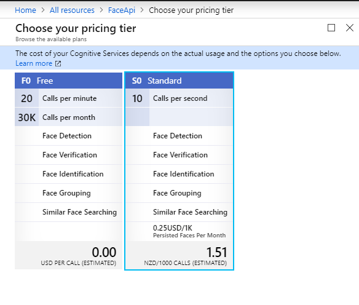
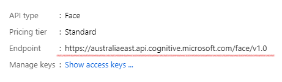
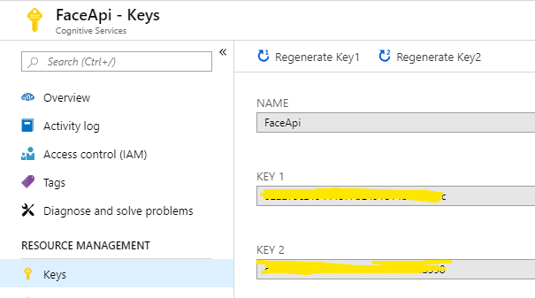
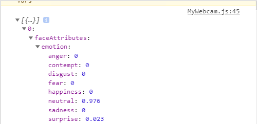

# A Simple Real-time Emotion Analyzer.

## Introduction

Welcome back to part 2 of **Cognitive Services** module. I hope you are learning lots and enjoying it so far! 📚

In this module we will be building an emotion analyzer component that detects and responses as player's emotion changes (aka. smiling) as they watch a montage of cat videos or you know, funny stuffs. 😹

Utilizing your webcam and cognitive services, we will build a movable camera preview components with a dynamic 'hapiness' meter. As you may have guessed, if the meter filled up to 100% then the player will be prompted a **'GAME OVER'** banner. 

So you better keep a straight face!   


 [place holder for a gif demo]
 
 
## 1. Building a webcam component. 📷
 
 In this section, we will first build our **MyWebcam** component to display the video feed on the screen as well as taking care of sending/retreiving API data.
 
We will use **_react-webcam_** package from **npm** to help us implement the webcam component. 

### 1.1 Install **react-webcam** package using npm 

Open powershell in the project directory and type `npm i react-webcam` to install **react-webcam** package from node.js package manager npm.

💡 **Tips:** Shift right click -> Open PowerShell window here

Read more: [react-webcam - npm](https://www.npmjs.com/package/react-webcam) 

### 1.2 Create a webcam component

Create a new JavaScript file under the **components** folder called **MyWebcam.js**.

Use `import Webcam from "react-webcam";`, and Create a class **MyWebcam.js**, which returns `<Webcam />` component. 

At the bottom don't forget to `export default MyWebcam` class component so that it is made available to use by other components.

<details><summary><b>View Code</b> 🖱️ </summary>


```javascript
import React from "react";
import Webcam from "react-webcam";
 
class MyWebcam extends React.Component {
  render() {
    return <Webcam />;
  }
}

export default MyWebcam
```

</details>


### 1.3 MyWebcam quick test 🔧

Let's test our newly defined component. In **App.js** import the component, and add it to a return statement in render function of the **App** class. 

Runs `npm start` from PowerShell to see the changes.

💡 **Tips:** Comment out part 1 components being return for now to easily test development of part 2. Use `Ctrl + K + F` simultaneously to comment out a section of code. Use `Ctrl + K + U` to uncomment. 

<details><summary><b>View Code</b> 🖱️ </summary>
<p>

```javascript
import MyWebcam from './components/MyWebcam'

class App extends Component {

...

    render() {
        return (<div>
            {/* <Title title={'No-Laugh Challenge'} />
            <AddVideo onAddVideo={(addedPost) => {
                this.addVideo(addedPost)
            }}/>
            <div className = "video-wrapper">
                <Displayer posts={this.state.posts} />
            </div> */}
            
            <MyWebcam />
            
        </div>
        )
    }
}
```

</p>
</details>


You should be able see the webcam in effect!

### 1.4 Adjusting the camera 

Next we will adjust the camera using the props value below. 

Here we use **setRef** to reference the `<Webcam />` component and assigning it to this.webcam variable, which allow us to later on invoke a function on webcam component.

We also defined a **videoConstraints** constant which define settings for our device's webcam.

Pass in both props as well as width and height into `<Webcam />` components .

Try experimenting with width and height props to see how they affect the size of the video element.

💡 **Tips:**  `Ctrl + A` to highlight all code then `Ctrl + K + F` to automatically format the indentation!

<details><summary><b>View Code</b> 🖱️ </summary>
<p>

```javascript
import React from "react";
import Webcam from "react-webcam";

class MyWebcam extends React.Component {

    setRef = webcam => {
        this.webcam = webcam;
    };


    render() {

        const videoConstraints = {
            width: 750,
            height: 500,
            facingMode: "user"
        };

        return (
            <Webcam
                audio={false}
                height={1000}
                width={750}
                ref={this.setRef}
                screenshotFormat="image/jpeg"
                videoConstraints={videoConstraints}
            />
        );
    }
}

export default MyWebcam

```

</p>
</details>

### 1.5 Capturing images from webcam

Let's create a method that will continuously take photos every 2 seconds (We will increase this rate later). 

Define a constructor for **MyWebcam** class with two properties `this.timerId`, which will allow us to reference and call clearInterval() to stop taking photos later, `this.isCapturing` is a simple boolean flag that will us to stop updating the UI with API data that arrives after we have stopped the timer.

Next, create **startCapturing** that execute a function to start the capturing process. Here we use `setInterval()` method to invoke `this.webcam.getScreenshot()` every 2 seconds which returns a base64 encoded string of the image. 

Finally add a 'Start Game!' button under the **Webcam** component, add a button with onClick attribute to fires `startCapturing` into taking photos every 2 seconds.

Run the app, open developer console `F12` and start the game, you should see the base64 encoded string representation of the image being logged.

💡 **Tips:** If you copy & paste the encoded image into the URL of chrome, you can render the image taken! 

<details><summary><b>View Code</b> 🖱️ </summary>
<p>

```javascript

class MyWebcam extends React.Component {
    constructor(props) {
        super(props);
        this.timerId = null;
        this.isCapturing = false;
    }

...

    startCapturing = () => {
        this.isCapturing = true;
        this.timerId = setInterval(() => {
            const image = this.webcam.getScreenshot();
            console.log(image);
        }, 2000);
    }
    
    render() {
    
...

        return (
            <div>
                <div>
                <Webcam
                    audio={false}
                    height={1000}
                    width={750}
                    ref={this.setRef}
                    screenshotFormat="image/jpeg"
                    videoConstraints={videoConstraints}
                />
                </div>
                <button variant="primary" onClick={this.startCapturing}>Start Game!</button>
            </div>
        );
    }
} 
    
   
```


</p>
</details>

## 2. Fetching emotion data from Cognitive Services face API

We will construct a function to send off an image and fetch a JSON response from the Microsoft Cognitive Services Face API.

### 2.1 Setting up Cognitive Services API

We can easily create our own instance of cognitive service to use through Azure. 

Log in to your [Azure portal](https://portal.azure.com), and in **+ Create a resource** search for 'Cognitive Services'

<p align="center"></p>

Go ahead and configure the setting as neccessary, in the **pricing tier** make sure to choose **S0** (10 Calls per second) so we are not limited to only 20 calls per minute. The trail credit Azure gave should be plenty for us to test & try out with our project.

<p align="center"></p>

Head over to your newly created service, note down the following

- **Overview -> Endpoint** note down the endpoint url.
- **Resource Management -> Keys** note down the key value.

<p align="center"> </p>

### 2.2 Converting base64 encoded image to byte array.

Looking at the [official document](https://westus.dev.cognitive.microsoft.com/docs/services/563879b61984550e40cbbe8d/operations/563879b61984550f30395236) for Face API, we will be sending the data to the endpoint using POST method. The body of the request could contain either a URL to an image or an array of binary data.

We will need to convert our base64 encoded string into an array of binary data. Let's use **base64-js** package to help us achieve this. 

**Read more here:** [base64-js - npm](https://www.npmjs.com/package/base64-js)

Open PowerShell in the project directory and run `npm i base64-js`.

Add **convertToByteArray** function to the **MyWebcam** class.

This function receive base64 encoded string, removed the header at the start and uses **base64-js** package to convert it to an array of byte.

We can now convert our image to a correct format ready to be sent to the cognitive service endpoint. Add a new `const byteArrayImage = this.convertToByteArray(image);` to our `startCapturing` function.


<details><summary><b>View Code</b> 🖱️ </summary>
<p>

```javascript

    startCapturing = () => {
        this.isCapturing = true;
        this.timerId = setInterval(() => {
            const image = this.webcam.getScreenshot();
            const byteArrayImage = this.convertToByteArray(image);
            console.log(image);
        }, 2000);
    }


    convertToByteArray = (image) => {
        const base64 = require('base64-js');
        const base64string = image.split(',')[1];
        return base64.toByteArray(base64string)
    };
```


</p>
</details>

💡 **Tips:** Make sure to regularly test your app. Use `npm start` in PowerShell to launch your app.

### 2.3 Using POST request to call cognitive services endpoint.

Define `fetchData` function ,which takes in a byteArray and makes a POST request to the Azure cognitive service. We will supply the header with our apiKey and apiEndpoint we noted down earlier, the body of the request will contains our byteArray of the image.

When specifying the apiEndpoint make sure to supply `/detect?returnFaceAttributes=emotion` argument at the end to return emotion data. Check out [API reference](https://westus.dev.cognitive.microsoft.com/docs/services/563879b61984550e40cbbe8d/operations/563879b61984550f30395236) to see what other options are available, experiment at your own will! 

e.g. `const apiEndpoint = 'https://australiaeast.api.cognitive.microsoft.com/face/v1.0/detect?returnFaceAttributes=emotion'`

For testing purposes we will `console.log(response.status)`. Make a call to `fetchData` function from the `startCapturing` function.

Launch your app and inspect the console, if everything is configure correctly you should be able to see the `200` (200 OK) printed, success status response code indicates that the request has succeeded. 


<details><summary><b>View Code</b> 🖱️ </summary>
<p>

```javascript

    startCapturing = () => {
        this.isCapturing = true;
        this.timerId = setInterval(() => {
            const image = this.webcam.getScreenshot();
            const byteArrayImage = this.convertToByteArray(image);
            this.fetchData(byteArrayImage);
        }, 2000);
    }


    fetchData = (byteArray) => {
        const apiKey = '[API-Key]';
        const apiEndpoint = '[API-Endpoint]'
        fetch(apiEndpoint, {
            body: byteArray,
            headers: {
                'cache-control': 'no-cache', 'Ocp-Apim-Subscription-Key': apiKey, 'Content-Type': 'application/octet-stream'
            },
            method: 'POST'
        }).then(response => {
            console.log(response.status);
        });
    }
```


</p>
</details>

### 2.4 Retrieving a happiness intensity value from a JSON response object.

We will be extracting the happiness intensity value from the response. (You can check the format of the JSON object return in the API reference.)

From the response received, we first check if the response is `200 OK`. We then JSON parsed the response, which allows us to access this object properties easily.

If we log the JSON data object to the console, we can see the following properties inside.


<p align="center"></p>

Therefore we extract the happiness value by grabbing first face object in the array returned from the response (if there's one), then get `faceAttributes`, then its `happiness` value respectively.

var happiness = (data[0] != null ? data[0].faceAttributes.emotion.happiness : 0);

Here we turn the value into `integer`, and into percentage by applying `happiness = (Math.round(happiness * 100))`.

```javascript

if (this.isCapturing && happiness < 100) {
    console.log(happiness);
} else {
    clearInterval(this.timerId);
    this.isCapturing = false;
    console.log('stop');
}                    

```
Above section simply check if happiness value reaches 100 then stop the game timer and set the `isCapturing` flag to false, so any left over response that arrives after the game has stopped will be ignored.

<details><summary><b>View Code</b> 🖱️ </summary>
<p>

```javascript
    fetchData = (byteArray) => {
        const apiKey = '[API-Key]';
        const apiEndpoint = 'https://australiaeast.api.cognitive.microsoft.com/face/v1.0/detect?returnFaceAttributes=emotion'
        fetch(apiEndpoint, {
            body: byteArray,
            headers: {
                'cache-control': 'no-cache', 'Ocp-Apim-Subscription-Key': apiKey, 'Content-Type': 'application/octet-stream'
            },
            method: 'POST'
        }).then(response => {
            if (response.ok) {
                response.json().then(data => {
                    var happiness = (data[0] != null ? data[0].faceAttributes.emotion.happiness : 0);
                    happiness = (Math.round(happiness * 100))
                    if (this.isCapturing && happiness < 100) {
                        console.log(happiness);
                    } else {
                        clearInterval(this.timerId);
                        this.isCapturing = false;
                        console.log('stop');
                    }
                });
            }
        });
    }
```

</p>
</details>

Now, test your app. In the console you should be getting the happiness intensity value based on your facial expression, and `stop` printed if the value reaches 100. 😊

### Progress Check

A quick progress check if you need. 

Your **MyWebcam.js** should look like this. 

<details><summary><b>View Code</b> 🖱️ </summary>
<p>

```javascript
import React from 'react';
import Webcam from 'react-webcam';
import Button from 'react-bootstrap/Button';

class MyWebcam extends React.Component {
    constructor(props) {
        super(props);
        this.timerId = null;
        this.isCapturing = false;
    }

    setRef = webcam => {
        this.webcam = webcam;
    };

    startCapturing = () => {
        this.isCapturing = true;
        this.timerId = setInterval(() => {
            const image = this.webcam.getScreenshot();
            const byteArrayImage = this.convertToByteArray(image);
            this.fetchData(byteArrayImage);
        }, 100);
    }

    convertToByteArray = (image) => {
        const base64 = require('base64-js');
        const base64string = image.split(',')[1];
        return base64.toByteArray(base64string)
    };

    fetchData = (byteArray) => {
        const apiKey = '[API-Key]';
        const apiEndpoint = '[API-Endpoint]'
        fetch(apiEndpoint, {
            body: byteArray,
            headers: {
                'cache-control': 'no-cache', 'Ocp-Apim-Subscription-Key': apiKey, 'Content-Type': 'application/octet-stream'
            },
            method: 'POST'
        }).then(response => {
            if (response.ok) {
                response.json().then(data => {
                    var happiness = (data[0] != null ? data[0].faceAttributes.emotion.happiness : 0);
                    happiness = (Math.round(happiness * 100))
                    if (this.isCapturing && happiness < 100) {
                        this.props.onReceivedResult(happiness);
                    } else {
                        clearInterval(this.timerId);
                        this.isCapturing = false;
                        this.props.onReceivedResult(100);
                    }
                });
            }
        });
    }

    render() {
        const videoConstraints = {
            width: 750,
            height: 500,
            facingMode: "user"
        };
        return (
            <div>
                <div>
                    <Webcam
                        audio={false}
                        height={250}
                        width={375}
                        ref={this.setRef}
                        screenshotFormat="image/jpeg"
                        videoConstraints={videoConstraints}
                    />
                </div>
                <Button variant="primary" onClick={this.startCapturing}>Start Game!</Button>
            </div>
        );
    }
}

export default MyWebcam;

```


</p>
</details>


==============================================
<details><summary><b>View Code</b> 🖱️ </summary>
<p>

```javascript
```


</p>
</details>


